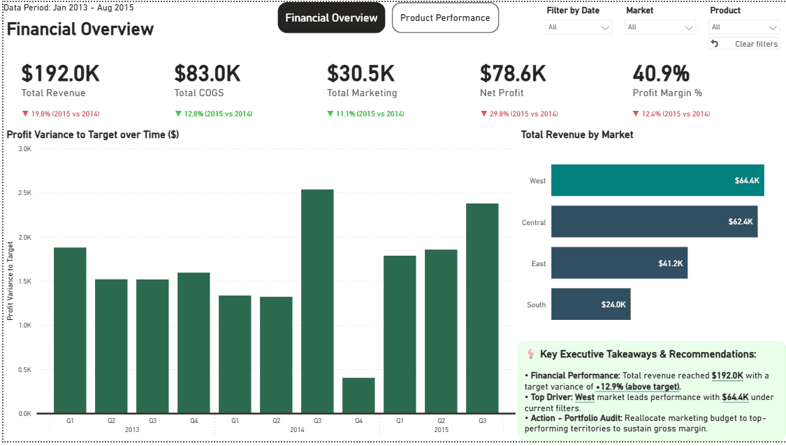
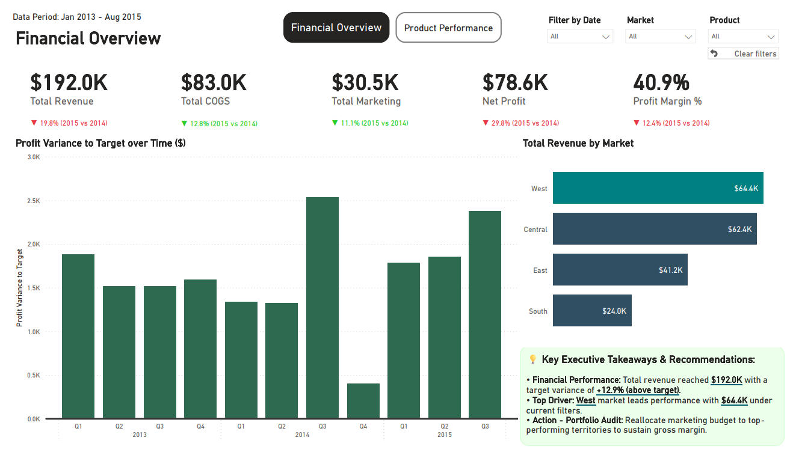
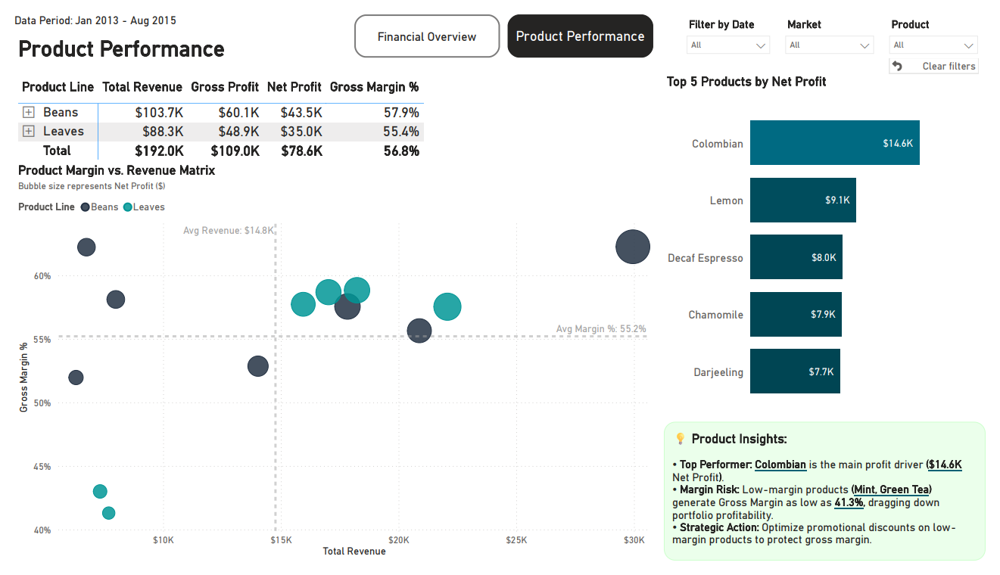
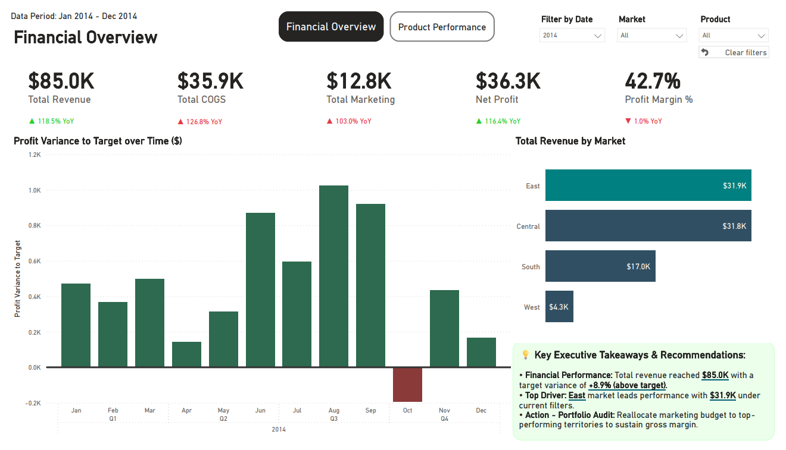
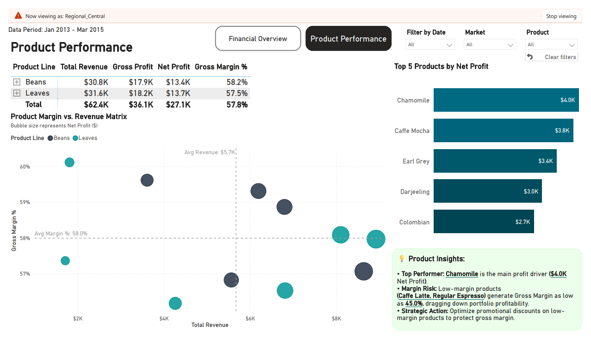

# Executive Coffee Chain Financial & Portfolio Analytics Dashboard




---

An end-to-end, executive-grade Power BI analytics solution engineered for retail and FMCG leadership. This dashboard delivers full-spectrum financial oversight (P&L decomposition from Gross Revenue down to Net Profit), rigorous Target vs. Actual variance tracking, and automated portfolio risk detection across product lines and regional territories.

---

## 🔗 Live Demo & Project Assets
* **Power BI Project File:** [Download .pbix File](pbix/Coffee_Chain_Analytics.pbix)
* **Author LinkedIn:** [Szymon Khrapachenko](https://www.linkedin.com/in/szymon-khrapachenko)

---

## 🖥️ Dashboard Architecture & Visual Design

The report features a high-density, executive-tailored interface structured into two strategic analytical layers:

### 1. Financial Overview (Executive P&L & Target Tracking)
* **Purpose:** High-level executive monitoring of enterprise profitability, cost structures, and multi-year budget variance.
* **Key Features:**
  * **P&L Integrity Cascade:** Full mathematical alignment: $\text{Revenue } (\$192.0\text{K}) - \text{COGS } (\$83.0\text{K}) = \text{Gross Profit } (\$109.0\text{K}) \rightarrow \text{Net Profit } (\$78.6\text{K})$ with a **40.9%** Net Margin.
  * **Cost-Inverted YoY Indicators:** Smart visual semantics where cost reductions (COGS & Marketing) dynamically render as positive (green) performance indicators.
  * **Quarterly Plan-Fact Variance:** Time-aggregated variance tracking eliminating month-level noise while surfacing seasonal dips (e.g., Q4 2014 shortfall).
  * **Dynamic Executive Takeaways:** DAX-generated real-time narrative summarizing top territory drivers and explicit budget pacing status (`+12.9% above target`).



### 2. Product Performance (Portfolio Risk & BCG Matrix)
* **Purpose:** Tactical root-cause exploration of product-line margins, unit economics, and individual SKU vulnerabilities.
* **Key Features:**
  * **Product Margin vs. Revenue Matrix:** 4-quadrant strategic scatter matrix benchmarked against dynamic average lines ($\text{Avg Revenue } \$14.8\text{K}$, $\text{Avg Margin } 55.2\%$), with bubble sizes encoding Net Profit ($).
  * **Cross-Filtering Drill-Down:** Synchronized cross-filtering isolating low-margin outliers upon visual selection.
  * **Automated Risk Flagging:** Dynamic narrative identifying underperforming outlier SKUs (**Mint, Green Tea**) dragging down product line profitability with margins as low as **41.3%**.



<details>
<summary>🔍 Click to view Dynamic Temporal Filtering & Row-Level Security (RLS) Isolation</summary>

### Dynamic Smart Narrative Recalculation (Filtered by 2014)


### Territorial RLS Isolation (Central Region: Product Performance View)


</details>

---

## 🏗️ Data Architecture & Modeling (Constellation Schema)

To resolve the industry-standard **Fact Grain Mismatch** (daily transactional sales vs. monthly/quarterly target budgets), the data layer was re-engineered from a flat denormalized structure into a robust **Constellation (Galaxy) Schema** with conformed dimensions:

```text
[ _Measures ]      [ Dim_Calendar ]      [ Dim_Product ]      [ Dim_Geography ]
                         |                     |   \                 |
                         | 1:N                 |    \ 1:N            | 1:N
                         v                     | 1:N \               v
                  [ Fact_Sales ] <-------------+      +-------> [ Fact_Targets ]
```
