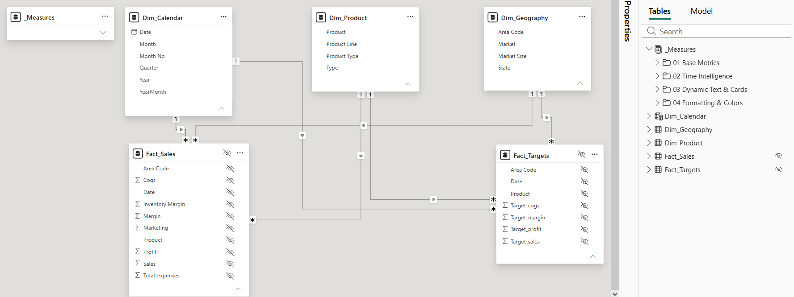

# Executive Coffee Chain Financial & Portfolio Analytics Dashboard


---

An end-to-end, executive-grade Power BI analytics solution engineered for retail and FMCG leadership. This dashboard delivers full-spectrum financial oversight (P&L decomposition from Gross Revenue down to Net Profit), rigorous Target vs. Actual variance tracking, and automated portfolio risk detection across product lines and regional territories.

---

## 🔗 Live Demo & Project Assets
* **Power BI Project File:** [Download .pbix File](pbix/Coffee_Chain_Analytics.pbix)
* **Author LinkedIn:** [Szymon Khrapachenko](https://www.linkedin.com/in/szymon-khrapachenko)

---

## 🖥️ Dashboard Architecture & Visual Design

The report features a high-density, executive-tailored interface structured into two strategic analytical layers:

### 1. Financial Overview (Executive P&L & Target Tracking)
* **Purpose:** High-level executive monitoring of enterprise profitability, cost structures, and multi-year budget variance.
* **Key Features:**
  * **P&L Integrity Cascade:** Full mathematical alignment: **Revenue ($192.0K) − COGS ($83.0K) = Gross Profit ($109.0K) → Net Profit ($78.6K)** with a **40.9%** Net Margin.
  * **Cost-Inverted YoY Indicators:** Smart visual semantics where cost reductions (COGS & Marketing) dynamically render as positive (green) performance indicators.
  * **Quarterly Plan-Fact Variance:** Time-aggregated variance tracking eliminating month-level noise while surfacing seasonal dips (e.g., Q4 2014 shortfall).
  * **Dynamic Executive Takeaways:** DAX-generated real-time narrative summarizing top territory drivers and explicit budget pacing status (`+12.9% above target`).


### 2. Product Performance (Portfolio Risk & BCG Matrix)
* **Purpose:** Tactical root-cause exploration of product-line margins, unit economics, and individual SKU vulnerabilities.
* **Key Features:**
  * **Product Margin vs. Revenue Matrix:** 4-quadrant strategic scatter matrix benchmarked against dynamic average lines (**Avg Revenue: $14.8K**, **Avg Margin: 55.2%**), with bubble sizes encoding Net Profit ($).
  * **Cross-Filtering Drill-Down:** Synchronized cross-filtering isolating low-margin outliers upon visual selection.
  * **Automated Risk Flagging:** Dynamic narrative identifying underperforming outlier SKUs (**Mint, Green Tea**) dragging down product line profitability with margins as low as **41.3%**.


<details>
<summary>🔍 Click to view Dynamic Temporal Filtering & Row-Level Security (RLS) Isolation</summary>

### Dynamic Smart Narrative Recalculation (Filtered by 2014)


### Territorial RLS Isolation (Central Region: Product Performance View)


</details>

---

## 🏗️ Data Architecture & Modeling (Constellation Schema)

To resolve the industry-standard **Fact Grain Mismatch** (daily transactional sales vs. monthly/quarterly target budgets), the data layer was re-engineered from a flat denormalized structure into a robust **Constellation (Galaxy) Schema** with conformed dimensions:

```text
[ _Measures ]      [ Dim_Calendar ]      [ Dim_Product ]      [ Dim_Geography ]
                         |                     |   \                 |
                         | 1:N                 |    \ 1:N            | 1:N
                         v                     | 1:N \               v
                  [ Fact_Sales ] <-------------+      +-------> [ Fact_Targets ]
```




---

## 📊 Dataset Specifications & Scale

* **Source:** Kaggle (Coffee Chain Sales Data).
* **Volume:** 1,062 transactional records spanning a ~3-year period (Oct 2012 – Aug 2015).
* **Dimensional Granularity:** 
  * **Geography:** 4 Markets (Central, South, East, West) across multiple US States and Area Codes.
  * **Product Portfolio:** 13 unique SKUs across 2 main Product Lines (Beans, Leaves).
* **Financial Scope:**
  * **Actuals:** `Sales` (Revenue), `COGS`, `Marketing`, `Total_expenses`, `Profit`.
  * **Targets (Budgets):** `Target_sales`, `Target_cogs`, `Target_margin`, `Target_profit`.
* **Architecture Challenge (Resolved):** The raw CSV contained a critical **Fact Grain Mismatch** — daily transactional facts and static monthly targets were flattened into the same rows. If left untreated, this leads to massive budget duplication in DAX. This was programmatically resolved in Power Query by decoupling the data into two isolated fact tables (`Fact_Sales` and `Fact_Targets`) tied to conformed dimensions.

### Key Data Attributes:
1. **Area Code:** Geographical identifier for territory mapping and RLS application.
2. **COGS (Cost of Goods Sold):** Total direct cost incurred in producing the sold coffee/tea products.
3. **Inventory Margin:** Variance between inventory maintenance costs and revenue generated.
4. **Profit & Target Profit:** Bottom-line financial gain used for Variance-to-Target analysis.

---

## ⚙️ Best Practices & Model Governance

* **Developer-Centric Source Control:** Formatted as Power BI Project (`.pbip`) utilizing TMDL/BIM schema structure for clean Git diff tracking, pull request code reviews, and seamless multi-developer collaboration.
* **Environment-Agnostic ETL Parameterization:** Implemented a global Power Query `DatasetFilePath` M-parameter across all ingestion pipelines, eliminating hardcoded local file paths and enabling zero-configuration environment portability.
* **Constellation (Galaxy) Schema Architecture:** Resolved critical Fact Grain Mismatch by decoupling transactional orders (`Fact_Sales`) from planning budgets (`Fact_Targets`), preventing budget duplication and protecting DAX calculation context.
* **Row-Level Security (RLS):** Implemented multi-role territorial data isolation (`Regional_Central`, `Regional_East`, `Regional_South`, `Regional_West`) via dimensional DAX predicates on `Dim_Geography[Market]` cascading cleanly through 1:N single-direction relationships.
* **Zero Implicit Measures Policy:** 100% of physical numeric columns across both fact tables (`Fact_Sales`, `Fact_Targets`) are hidden from the report layer to enforce central explicit measure consumption.
* **Display Folder Taxonomy:** Centralized `_Measures` table organized into a structured 4-tier functional hierarchy (`01 Base Metrics`, `02 Time Intelligence`, `03 Dynamic Text & Cards`, `04 Formatting & Colors`).
* **VertiPaq Engine Optimization:** Single-directional 1:N relationships on integer keys (`Area Code`, `Date`), removal of calculated columns from facts, and strict dictionary encoding on dimensional text attributes (`Market`, `Product Line`).

---

## 💻 DAX Showcase

**1. Dynamic Portfolio Risk Detection (Outlier SKU Extraction)**

Dynamically scans product-level margins within the active filter context, isolates underperforming SKU outliers dragging down category profitability (< 45.0% Gross Margin), and aggregates their names for executive-level narrative cards:

```dax
Low_Margin_Outliers_Names = 
VAR Outliers = 
    CALCULATETABLE(
        VALUES('Dim_Product'[Product]),
        FILTER('Dim_Product', [Gross Margin %] < 0.45)
    )
VAR ProductCount = COUNTROWS(Outliers)
RETURN
IF(
    ProductCount > 0,
    CONCATENATEX(Outliers, 'Dim_Product'[Product], ", "),
    "None"
)
```

**2. Context-Aware Plan vs. Actual Variance Narrative**

Evaluates target variance with explicit mathematical sign handling and qualitative pacing descriptors (`above target` vs. `below target`), ensuring executive stakeholders immediately grasp budget performance:

```dax
Revenue_Variance_Text = 
VAR Actual = [Total Revenue]
VAR Target = [Target Revenue]
VAR Pct = DIVIDE(Actual - Target, Target, BLANK())
VAR SignPrefix = IF(Pct > 0, "+", "")
VAR StatusText = IF(Pct >= 0, "above target", "below target")
RETURN
IF(
    ISBLANK(Pct),
    "N/A",
    SignPrefix & FORMAT(Pct, "0.0%", "en-US") & " (" & StatusText & ")"
)
```

**3. Strict Multi-Tier P&L & Cost-Inverted Variance Semantics**

Enforces GAAP/IFRS P&L cascading logic while providing dedicated UI color formatting logic for operational cost line items (COGS & Marketing), where negative YoY growth indicates operational savings (Green) rather than a business shortfall:

```dax
-- Core Waterfall Cascading Metric
Net Profit = [Gross Profit] - [Total Marketing]

-- Cost-Inverted UI Indicator Logic (Example for COGS YoY)
COGS YoY Color = 
VAR YoY_Variance = [COGS YoY %]
RETURN
SWITCH(
    TRUE(),
    ISBLANK(YoY_Variance), "#606266",
    YoY_Variance < 0, "#2E7D32", -- Cost reduction is positive (Green)
    YoY_Variance > 0, "#D32F2F", -- Cost increase is negative (Red)
    "#606266"
)
```

---

## 📁 Repository Structure

```text
├── Coffee_Chain_Analytics.Report/         # Visual & Layout Configuration (PBIP Format)
├── Coffee_Chain_Analytics.SemanticModel/  # Galaxy Model, DAX Measures, TMDL Schema & RLS
├── Coffee_Chain_Analytics.pbip            # Power BI Project Entry File (Developer Mode)
├── Coffee_Chain_Analytics.pdf             # Executive Dashboard PDF Export
├── pbix/
│   └── Coffee_Chain_Analytics.pbix        # Production Power BI Single-File Workbook
├── screenshots/
│   ├── 01_financial_overview.png
│   ├── 02_product_performance.png
│   ├── 03_financial_overview_filtered_2014.png
│   ├── 04_product_performance_RLS_central_products.png
│   ├── 05_data_model.png
│   └── GifProjekt_2.gif                   # Interactive User Journey Demo
└── README.md                              # Enterprise Project Documentation
```

## 🛠️ Technical Stack

* **BI & ETL Platform:** Microsoft Power BI Desktop (Power Query / M-Code Parameterization via DatasetFilePath)

* **Analytics & Modeling Language:** DAX (Data Analysis Expressions — Explicit Measures, Advanced Iterators, Dynamic Narrative Interpolation)

* **Data Architecture:** Enterprise Dimensional Modeling (Constellation / Galaxy Schema with Conformed Dimensions & Granularity Decoupling)

* **Data Governance & Security:** Dynamic & Static Row-Level Security (RLS), Zero Implicit Measures Policy

* **Developer Workflow & Version Control:** Power BI Project (.pbip), TMDL/BIM Schema Serialization, Git / GitHub
